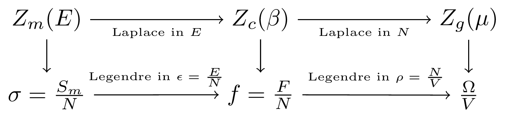

<h1 align="center">
  <a href="https://janosh.github.io/tikz">
    
  </a>
</h1>

<h3 align="center">

[](https://latex-project.org)
[](https://github.com/janosh/tikz/actions/workflows/gh-pages.yml)
[](https://github.com/janosh/tikz/actions/workflows/link-check.yml)
[](https://github.com/janosh/tikz/pulls)
[](https://zenodo.org/badge/latestdoi/286220365)

</h3>

Collection **110** `standalone` TikZ figures for illustrating concepts in physics, chemistry and machine learning.

Check out [janosh.github.io](https://janosh.github.io/tikz) to search, sort, open in Overleaf and download figures (PDF/SVG/PNG) from this collection.

Have a TikZ image you'd like to share? [Submit a PR](https://github.com/janosh/tikz/pulls) with a `.tex` and metadata `.yml` file in the `assets/` directory and add yourself to the [`citation.cff`](citation.cff) file.

## Images

| &emsp;&emsp;&emsp;&emsp;&emsp;&emsp;&emsp;&emsp;&emsp;&emsp;&emsp;&emsp;&emsp;&emsp;&emsp;&emsp;&emsp;&emsp;&emsp;&emsp;&emsp;&emsp; | &emsp;&emsp;&emsp;&emsp;&emsp;&emsp;&emsp;&emsp;&emsp;&emsp;&emsp;&emsp;&emsp;&emsp;&emsp;&emsp;&emsp;&emsp;&emsp;&emsp;&emsp;&emsp; |
| :----------------------------------------------------------------------------------------------------------------------------------: | :----------------------------------------------------------------------------------------------------------------------------------: |
|                               [`detailed-balance.tex`](https://janosh.github.io/tikz/detailed-balance)                               |                                   [`bloch-sphere.tex`](https://janosh.github.io/tikz/bloch-sphere)                                   |
|                                                                     |                                                                                 |
|                 [`maxwell-boltzmann-distribution.tex`](https://janosh.github.io/tikz/maxwell-boltzmann-distribution)                 |                  [`bose-einstein-distribution-3d.tex`](https://janosh.github.io/tikz/bose-einstein-distribution-3d)                  |
|                           |                              |
|                     [`bose-einstein-distribution.tex`](https://janosh.github.io/tikz/bose-einstein-distribution)                     |                               [`branch-and-bound.tex`](https://janosh.github.io/tikz/branch-and-bound)                               |
|                                       |                                                                     |
|                                  [`branch-cuts-1.tex`](https://janosh.github.io/tikz/branch-cuts-1)                                  |                                    [`mphil-gantt.tex`](https://janosh.github.io/tikz/mphil-gantt)                                    |
|                                                                              |                                                                                    |
|                              [`concave-functions.tex`](https://janosh.github.io/tikz/concave-functions)                              |                            [`matsubara-contour-1.tex`](https://janosh.github.io/tikz/matsubara-contour-1)                            |
|                                                                  |                                                            |
|                            [`matsubara-contour-2.tex`](https://janosh.github.io/tikz/matsubara-contour-2)                            |                            [`matsubara-contour-3.tex`](https://janosh.github.io/tikz/matsubara-contour-3)                            |
|                                                            |                                                            |
|                            [`matsubara-contour-4.tex`](https://janosh.github.io/tikz/matsubara-contour-4)                            |                            [`matsubara-contour-5.tex`](https://janosh.github.io/tikz/matsubara-contour-5)                            |
|                                                            |                                                            |
|                               [`convex-functions.tex`](https://janosh.github.io/tikz/convex-functions)                               |                           [`critical-temperature.tex`](https://janosh.github.io/tikz/critical-temperature)                           |
|                                                                     |                                                         |
|                                  [`branch-cuts-2.tex`](https://janosh.github.io/tikz/branch-cuts-2)                                  |                                     [`otto-cycle.tex`](https://janosh.github.io/tikz/otto-cycle)                                     |
|                                                                              |                                                                                       |
|                  [`matsubara-contour-deformation.tex`](https://janosh.github.io/tikz/matsubara-contour-deformation)                  |                                    [`dft-choices.tex`](https://janosh.github.io/tikz/dft-choices)                                    |
|                              |                                                                                    |
|                [`feynman-diagram-propagator-loop.tex`](https://janosh.github.io/tikz/feynman-diagram-propagator-loop)                |                                       [`diagrams.tex`](https://janosh.github.io/tikz/diagrams)                                       |
|                        |                                                                                             |
|                  [`energy-distribution-functions.tex`](https://janosh.github.io/tikz/energy-distribution-functions)                  |                                     [`divergence.tex`](https://janosh.github.io/tikz/divergence)                                     |
|                              |                                                                                       |
|                             [`potential-triangle.tex`](https://janosh.github.io/tikz/potential-triangle)                             |                                        [`dropout.tex`](https://janosh.github.io/tikz/dropout)                                        |
|                                                               |                                                                                                |
|                                [`physics-mindmap.tex`](https://janosh.github.io/tikz/physics-mindmap)                                |                                        [`ergodic.tex`](https://janosh.github.io/tikz/ergodic)                                        |
|                                                                        |                                                                                                |
|                            [`fermi-dirac-vs-temp.tex`](https://janosh.github.io/tikz/fermi-dirac-vs-temp)                            |                                      [`feynman-1.tex`](https://janosh.github.io/tikz/feynman-1)                                      |
|                                                            |                                                                                          |
|                                      [`feynman-2.tex`](https://janosh.github.io/tikz/feynman-2)                                      |                                      [`feynman-3.tex`](https://janosh.github.io/tikz/feynman-3)                                      |
|                                                                                          |                                                                                          |
|                                      [`feynman-4.tex`](https://janosh.github.io/tikz/feynman-4)                                      |                                   [`fluctuations.tex`](https://janosh.github.io/tikz/fluctuations)                                   |
|                                                                                          |                                                                                 |
|                                      [`gravitons.tex`](https://janosh.github.io/tikz/gravitons)                                      |                                      [`isotherms.tex`](https://janosh.github.io/tikz/isotherms)                                      |
|                                                                                          |                                                                                          |
|                             [`jensens-inequality.tex`](https://janosh.github.io/tikz/jensens-inequality)                             |                                        [`k-space.tex`](https://janosh.github.io/tikz/k-space)                                        |
|                                                               |                                                                                                |
|                                [`kohn-sham-cycle.tex`](https://janosh.github.io/tikz/kohn-sham-cycle)                                |                                           [`rnvp.tex`](https://janosh.github.io/tikz/rnvp)                                           |
|                                                                        |                                                                                                         |
|                                           [`loop.tex`](https://janosh.github.io/tikz/loop)                                           |                                          [`loops.tex`](https://janosh.github.io/tikz/loops)                                          |
|                                                                                                         |                                                                                                      |
|                                       [`m-theory.tex`](https://janosh.github.io/tikz/m-theory)                                       |                                    [`mexican-hat.tex`](https://janosh.github.io/tikz/mexican-hat)                                    |
|                                                                                             |                                                                                    |
|                               [`normalizing-flow.tex`](https://janosh.github.io/tikz/normalizing-flow)                               |                                      [`one-point.tex`](https://janosh.github.io/tikz/one-point)                                      |
|                                                                     |                                                                                          |
|                             [`operator-orderings.tex`](https://janosh.github.io/tikz/operator-orderings)                             |                            [`single-head-attention`](https://janosh.github.io/tikz/single-head-attention)                            |
|                                                               |                                                      |
|                                          [`poles.tex`](https://janosh.github.io/tikz/poles)                                          |                                [`higgs-potential.tex`](https://janosh.github.io/tikz/higgs-potential)                                |
|                                                                                                      |                                                                        |
|                        [`propagator-fluctuations.tex`](https://janosh.github.io/tikz/propagator-fluctuations)                        |                                    [`propagators.tex`](https://janosh.github.io/tikz/propagators)                                    |
|                                                |                                                                                    |
|                                  [`random-forest.tex`](https://janosh.github.io/tikz/random-forest)                                  |                            [`regular-vs-bayes-nn.tex`](https://janosh.github.io/tikz/regular-vs-bayes-nn)                            |
|                                                                              |                                                            |
|                                   [`saddle-point.tex`](https://janosh.github.io/tikz/saddle-point)                                   |                                   [`sbs-aktionen.tex`](https://janosh.github.io/tikz/sbs-aktionen)                                   |
|                                                                                 |                                                                                 |
|                                 [`seebeck-effect.tex`](https://janosh.github.io/tikz/seebeck-effect)                                 |                                          [`shell.tex`](https://janosh.github.io/tikz/shell)                                          |
|                                                                           |                                                                                                      |
|                                    [`autoencoder.tex`](https://janosh.github.io/tikz/autoencoder)                                    |                                     [`sign-plane.tex`](https://janosh.github.io/tikz/sign-plane)                                     |
|                                                                                    |                                                                                       |
|                          [`complex-sign-function.tex`](https://janosh.github.io/tikz/complex-sign-function)                          |                                 [`relation-space.tex`](https://janosh.github.io/tikz/relation-space)                                 |
|                                                      |                                                                           |
|                      [`spontaneous-magnetization.tex`](https://janosh.github.io/tikz/spontaneous-magnetization)                      |                                           [`tanh.tex`](https://janosh.github.io/tikz/tanh)                                           |
|                                          |                                                                                                         |
|                                   [`theory-space.tex`](https://janosh.github.io/tikz/theory-space)                                   |                       [`closed-string-topologies.tex`](https://janosh.github.io/tikz/closed-string-topologies)                       |
|                                                                                 |                                             |
|                         [`open-string-topologies.tex`](https://janosh.github.io/tikz/open-string-topologies)                         |                                           [`tori.tex`](https://janosh.github.io/tikz/tori)                                           |
|                                                   |                                                                                                         |
|                              [`cylinder-to-plane.tex`](https://janosh.github.io/tikz/cylinder-to-plane)                              |                                  [`disk-to-plane.tex`](https://janosh.github.io/tikz/disk-to-plane)                                  |
|                                                                  |                                                                              |
|                                 [`plane-to-torus.tex`](https://janosh.github.io/tikz/plane-to-torus)                                 |                       [`torus-fundamental-domain.tex`](https://janosh.github.io/tikz/torus-fundamental-domain)                       |
|                                                                           |                                             |
|                                [`transformations.tex`](https://janosh.github.io/tikz/transformations)                                |                            [`two-point-no-cutoff.tex`](https://janosh.github.io/tikz/two-point-no-cutoff)                            |
|                                                                        |                                                            |
|                                      [`two-point.tex`](https://janosh.github.io/tikz/two-point)                                      |              [`unregularized-propagator-diagrams.tex`](https://janosh.github.io/tikz/unregularized-propagator-diagrams)              |
|                                                                                          |                  |
|                                           [`wall.tex`](https://janosh.github.io/tikz/wall)                                           |                             [`wetterich-equation.tex`](https://janosh.github.io/tikz/wetterich-equation)                             |
|                                                                                                         |                                                               |
|                                        [`zt-vs-n.tex`](https://janosh.github.io/tikz/zt-vs-n)                                        |                            [`change-of-variables.tex`](https://janosh.github.io/tikz/change-of-variables)                            |
|                                                                                                |                                                            |
|                                [`four-vs-of-data.tex`](https://janosh.github.io/tikz/four-vs-of-data)                                |               [`materials-informatics-challenges.tex`](https://janosh.github.io/tikz/materials-informatics-challenges)               |
|                                                                        |                     |
|                              [`nf-coupling-layer.tex`](https://janosh.github.io/tikz/nf-coupling-layer)                              |                                           [`made.tex`](https://janosh.github.io/tikz/made)                                           |
|                                                                  |                                                                                                         |
|                                            [`gan.tex`](https://janosh.github.io/tikz/gan)                                            |                                            [`vae.tex`](https://janosh.github.io/tikz/vae)                                            |
|                                                                                                            |                                                                                                            |
|                                            [`hea.tex`](https://janosh.github.io/tikz/hea)                                            |                                 [`qm-cost-vs-acc.tex`](https://janosh.github.io/tikz/qm-cost-vs-acc)                                 |
|                                                                                                            |                                                                           |
|                                   [`roost-update.tex`](https://janosh.github.io/tikz/roost-update)                                   |                             [`sabatier-principle.tex`](https://janosh.github.io/tikz/sabatier-principle)                             |
|                                                                                 |                                                               |
|                                            [`maf.tex`](https://janosh.github.io/tikz/maf)                                            |                                 [`self-attention.tex`](https://janosh.github.io/tikz/self-attention)                                 |
|                                                                                                            |                                                                           |
|                               [`organic-molecule.tex`](https://janosh.github.io/tikz/organic-molecule)                               |                                        [`heatmap.tex`](https://janosh.github.io/tikz/heatmap)                                        |
|                                                                     |                                                                                                |
|                          [`materials-informatics.tex`](https://janosh.github.io/tikz/materials-informatics)                          |                                [`geometric-bayes.tex`](https://janosh.github.io/tikz/geometric-bayes)                                |
|                                                      |                                                                        |
|                                         [`conv2d.tex`](https://janosh.github.io/tikz/conv2d)                                         |                                [`skip-connection.tex`](https://janosh.github.io/tikz/skip-connection)                                |
|                                                                                                   |                                                                        |
|                           [`harm-osc-energy-freq.tex`](https://janosh.github.io/tikz/harm-osc-energy-freq)                           |                       [`harm-osc-energy-inv-temp.tex`](https://janosh.github.io/tikz/harm-osc-energy-inv-temp)                       |
|                                                         |                                             |
|                                [`wyckoff-positions`](https://janosh.github.io/tikz/wyckoff-positions)                                |                                         [`aviary.tex`](https://janosh.github.io/tikz/aviary)                                         |
|                                                                  |                                                                                                   |
|                                [`graph-isomorphism`](https://janosh.github.io/tikz/graph-isomorphism)                                |                                 [`periodic-table.tex`](https://janosh.github.io/tikz/periodic-table)                                 |
|                                                                  |                                                                           |
|                                           [`mosfet`](https://janosh.github.io/tikz/mosfet)                                           |                                [`plate-capacitor.tex`](https://janosh.github.io/tikz/plate-capacitor)                                |
|                                                                                                   |                                                                        |
|                                [`basis + lattice`](https://janosh.github.io/tikz/basis-plus-lattice)                                 |                               [`thomson-scattering`](https://janosh.github.io/tikz/thomson-scattering)                               |
|                                                               |                                                               |

## Scripts

Files in [`/scripts`](scripts) render and compress the standalone `.tex` files in [`/assets`](assets) to various formats:

- low + high-res PNG
- PDF
- SVG

To run the scripts requires the following dependencies:

- [`pdf-compressor`](https://github.com/janosh/pdf-compressor) (`pip install pdf-compressor`)
- [`gs` (GhostScript)](https://ghostscript.com) (optional, worse compression but needs no API key so less setup than `pdf-compressor`)
- [`pdf2svg`](https://github.com/dawbarton/pdf2svg) (`brew install pdf2svg`)
- [`convert`](https://linux.die.net/man/1/convert) (part of [ImageMagick](https://imagemagick.org/script))
- [`pngquant`](https://github.com/kornelski/pngquant) (`brew install pngquant`)
- [`zopflipng`](https://github.com/google/zopfli) (`brew install zopfli`)

To run `pdf-compressor` directly or to use it as part of the [`render-tikz.py`](scripts/render-tikz.py) pipeline, you need a free public API key from <https://developer.ilovepdf.com>. Pass it to `pdf-compressor` with:

```sh
pdf-compressor --set-api-key project_public_7c854a9db0...
```

## 📖 &thinsp; How to cite

You can cite the [Zenodo record](https://zenodo.org/badge/latestdoi/286220365) using the following BibTeX entry:

```bib
@software{riebesell_tikz_2020,
  title = {Collection of standalone TikZ images},
  author = {Riebesell, Janosh},
  date = {2020-08-09},
  year = {2020},
  doi = {10.5281/zenodo.7486911},
  url = {https://github.com/janosh/tikz},
  note = {10.5281/zenodo.7486911 - https://github.com/janosh/tikz},
  version = {0.1.0},
  urldate = {2023-01-01}, % optional, replace with your date of access
}
```
