# TikZ Standalone

Random collection of [`standalone`](https://ctan.org/pkg/standalone) [TikZ](https://ctan.org/pkg/pgf) images accumulated over the years.

## Previews

| [`detailed-balance.tex`](assets/detailed-balance)                                                              | [`bloch.tex`](assets/bloch)                                                                                                               |
| -------------------------------------------------------------------------------------------------------------- | ----------------------------------------------------------------------------------------------------------------------------------------- |
|                       |                                                                                   |
| [`boltzmann.tex`](assets/boltzmann)                                                                            | [`bose-distribution-3d.tex`](assets/bose-distribution-3d)                                                                                 |
|                                            | 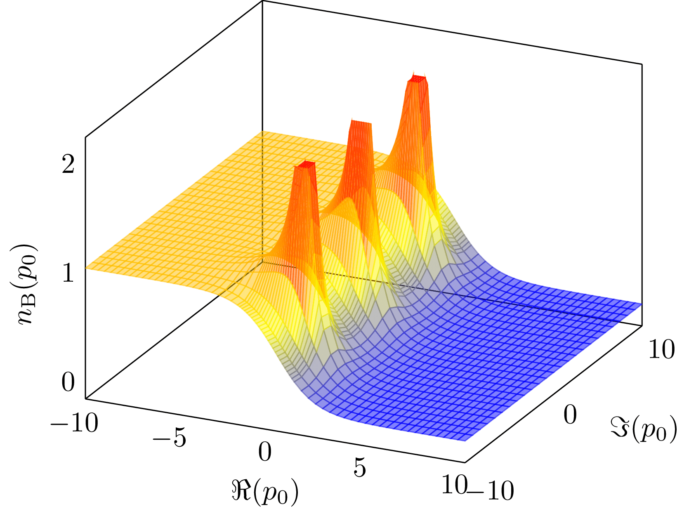                                     |
| [`bose-distribution.tex`](assets/bose-distribution)                                                            | [`branch-and-bound.tex`](assets/branch-and-bound)                                                                                         |
|                    |                                                  |
| [`branch-cuts.tex`](assets/branch-cuts)                                                                        | [`cambridge-mphil-gantt.tex`](assets/cambridge-mphil-gantt)                                                                               |
| 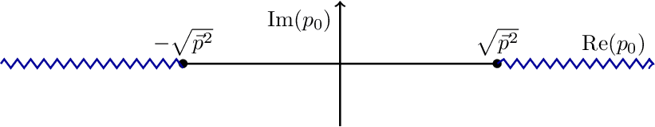                                     | 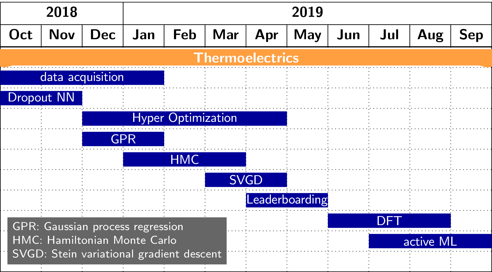                                  |
| [`concave.tex`](assets/concave)                                                                                | [`contour-1.tex`](assets/contour-1)                                                                                                       |
| 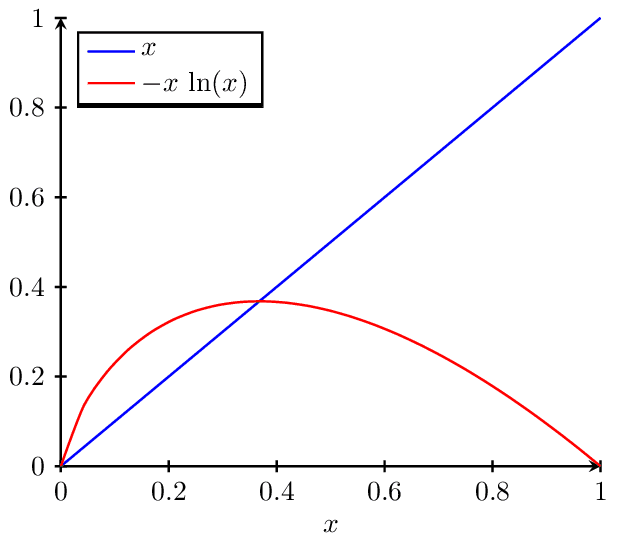                                                 | 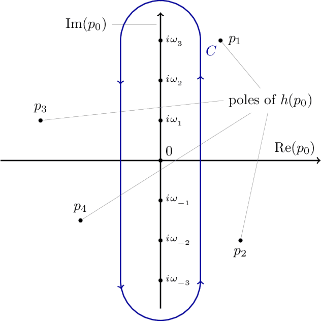                                                                      |
| [`contour-2.tex`](assets/contour-2)                                                                            | [`contour-3.tex`](assets/contour-3)                                                                                                       |
|                                            | 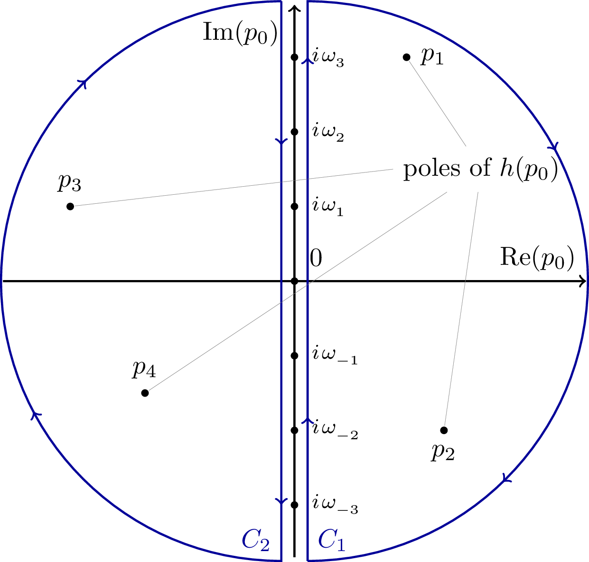                                                                      |
| [`contour-4.tex`](assets/contour-4)                                                                            | [`contour-5.tex`](assets/contour-5)                                                                                                       |
| 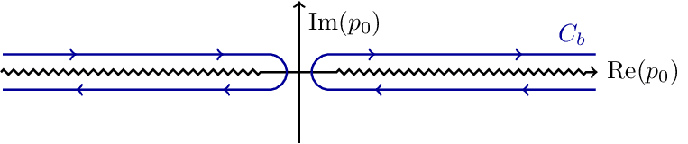                                           | 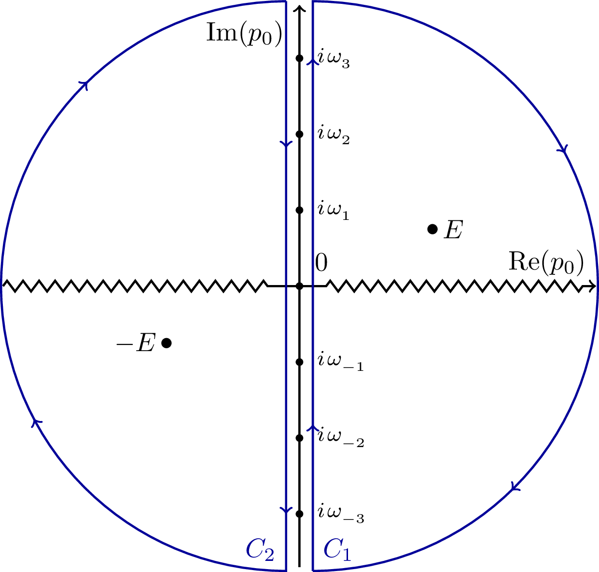                                                                      |
| [`convex.tex`](assets/convex)                                                                                  | [`critical.tex`](assets/critical)                                                                                                         |
| 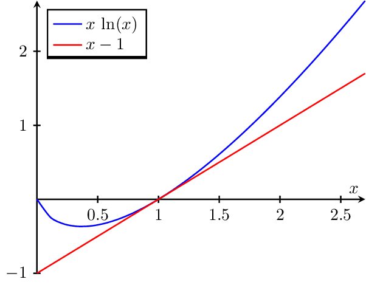                                                    | 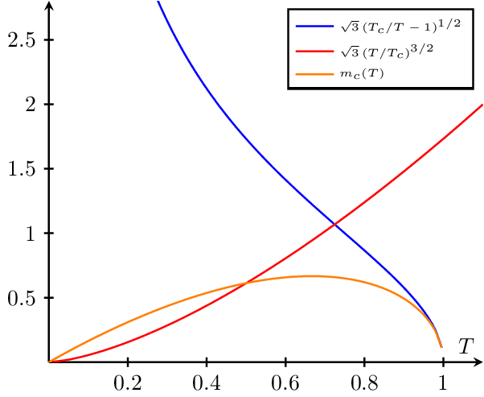                                                                         |
| [`cuts.tex`](assets/cuts)                                                                                      | [`otto-cycle.tex`](assets/otto-cycle)                                                                                                     |
| 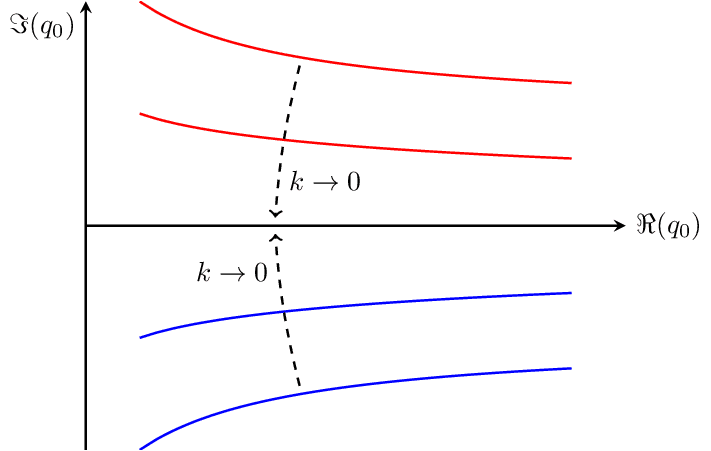                                                          |                                                                    |
| [`contour-deformation.tex`](assets/contour-deformation)                                                        | [`dft-choices.tex`](assets/dft-choices)                                                                                                   |
| 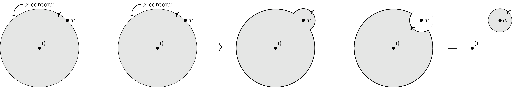                     |                                                                 |
| [`diagram.tex`](assets/diagram)                                                                                | [`diagrams.tex`](assets/diagrams)                                                                                                         |
| 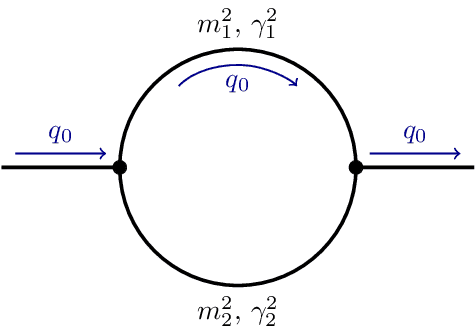                                                 |                                                                          |
| [`distributions.tex`](assets/distributions)                                                                    | [`divergence.tex`](assets/divergence)                                                                                                     |
|                                |                                                                    |
| [`dreieck.tex`](assets/dreieck)                                                                                | [`dropout.tex`](assets/dropout)                                                                                                           |
|                                                  |                                                                             |
| [`energie.tex`](assets/energie)                                                                                | [`ergodic.tex`](assets/ergodic)                                                                                                           |
| 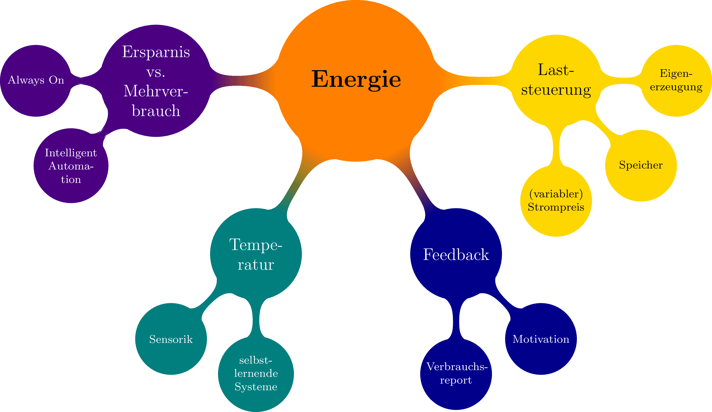                                                 |                                                                             |
| [`fermi.tex`](assets/fermi)                                                                                    | [`feynman-1.tex`](assets/feynman-1)                                                                                                       |
|                                                        |                                                                       |
| [`feynman-2.tex`](assets/feynman-2)                                                                            | [`feynman-3.tex`](assets/feynman-3)                                                                                                       |
|                                            |                                                                       |
| [`feynman-4.tex`](assets/feynman-4)                                                                            | [`fluctuations.tex`](assets/fluctuations)                                                                                                 |
|                                            |                                                              |
| [`gravitons.tex`](assets/gravitons)                                                                            | [`isotherms.tex`](assets/isotherms)                                                                                                       |
|                                            |                                                                       |
| [`jensens-inequality.tex`](assets/jensens-inequality)                                                          | [`k-space.tex`](assets/k-space)                                                                                                           |
|                 |                                                                             |
| [`kohn-sham-cycle.tex`](assets/kohn-sham-cycle)                                                                | [`komfort.tex`](assets/komfort)                                                                                                           |
|                          |                                                                             |
| [`loop.tex`](assets/loop)                                                                                      | [`loops.tex`](assets/loops)                                                                                                               |
|                                                           |                                                                                   |
| [`m-theory.tex`](assets/m-theory)                                                                              | [`mexican-hat.tex`](assets/mexican-hat)                                                                                                   |
|                                               |                                                                 |
| [`normalizing-flow.tex`](assets/normalizing-flow)                                                              | [`one-point.tex`](assets/one-point)                                                                                                       |
|                       |                                                                       |
| [`operator-orderings.tex`](assets/operator-orderings)                                                          | [`phd-gantt.tex`](assets/phd-gantt)                                                                                                       |
|                 |                                                                       |
| [`poles.tex`](assets/poles)                                                                                    | [`higgs-potential.tex`](assets/higgs-potential)                                                                                           |
|                                                        |                                                     |
| [`propagator-fluctuations.tex`](assets/propagator-fluctuations)                                                | [`propagators.tex`](assets/propagators)                                                                                                   |
|  |                                                                 |
| [`random-forest.tex`](assets/random-forest)                                                                    | [`regular-vs-bayes-nn.tex`](assets/regular-vs-bayes-nn)                                                                                   |
|                                |                                         |
| [`saddle.tex`](assets/saddle)                                                                                  | [`sbs-aktionen.tex`](assets/sbs-aktionen)                                                                                                 |
|                                                     |                                                              |
| [`seebeck-effect.tex`](assets/seebeck-effect)                                                                  | [`shell.tex`](assets/shell)                                                                                                               |
|                             |                                                                                   |
| [`sicherheit.tex`](assets/sicherheit)                                                                          | [`sign-plane.tex`](assets/sign-plane)                                                                                                     |
|                                         |                                                                    |
| [`sign.tex`](assets/sign)                                                                                      | [`relation-space.tex`](assets/relation-space)                                                                                             |
|                                                           |                                                        |
| [`spontaneous.tex`](assets/spontaneous)                                                                        | [`tanh.tex`](assets/tanh)                                                                                                                 |
| 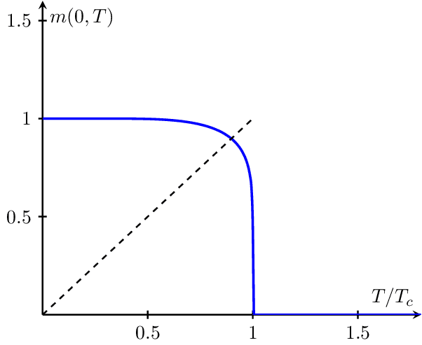                                     |                                                                                      |
| [`theory-space.tex`](assets/theory-space)                                                                      | [`closed-string-topologies.tex`](assets/closed-string-topologies)                                                                         |
|                                   |                          |
| [`open-string-topologies.tex`](assets/open-string-topologies)                                                  | [`tori.tex`](assets/tori)                                                                                                                 |
|     |                                                                                      |
| [`cylinder-to-plane.tex`](assets/cylinder-to-plane)                                                            | [`disk-to-plane.tex`](assets/disk-to-plane)                                                                                               |
|                    |                                                           |
| [`plane-to-torus.tex`](assets/plane-to-torus)                                                                  | [`torus-fundamental-domain.tex`](assets/torus-fundamental-domain)                                                                         |
|                             |                          |
| [`transformations.tex`](assets/transformations)                                                                | [`two-point-no-cutoff.tex`](assets/two-point-no-cutoff)                                                                                   |
|                          |                                         |
| [`two-point.tex`](assets/two-point)                                                                            | [`unregularized-propagator.tex`](assets/unregularized-propagator)                                                                         |
|                                            |        |
| [`wall.tex`](assets/wall)                                                                                      | [`wetterich-equation.tex`](assets/wetterich-equation)                                                                                     |
|                                                           |                                            |
| [`zt-vs-n.tex`](assets/zt-vs-n)                                                                                | [`change-of-variables.tex`](assets/change-of-variables)                                                                                   | [`wetterich-equation.tex`](assets/wetterich-equation) |
|                                                  |                                         |
| [`four-vs-of-data.tex`](assets/four-vs-of-data)                                                                | [`materials-informatics-challenges.tex`](assets/materials-informatics-challenges)                                                         | [`wetterich-equation.tex`](assets/wetterich-equation) |
|                          |  |
