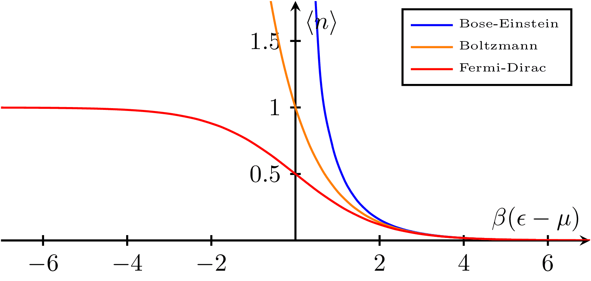
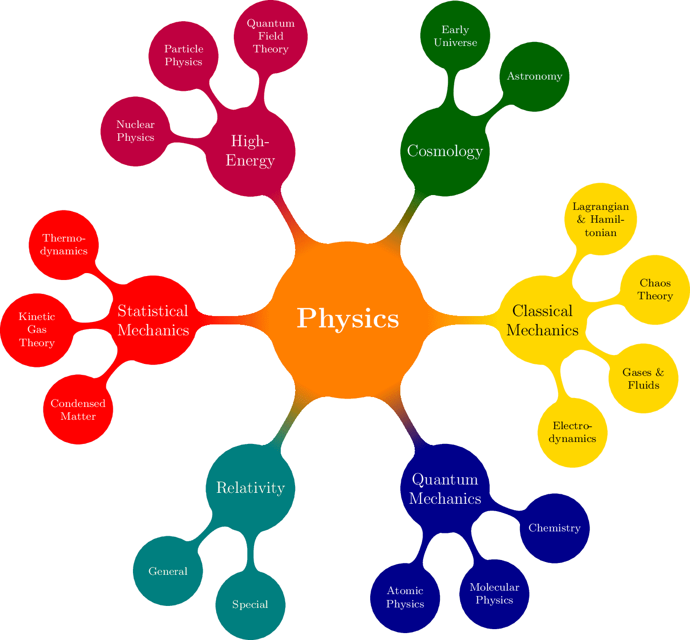
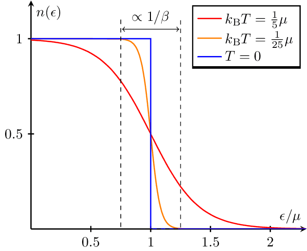
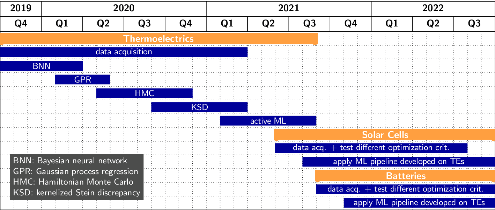
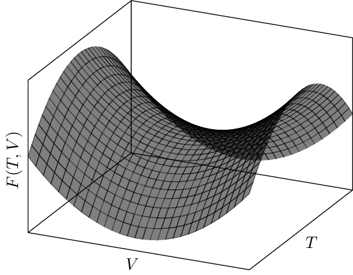

<h1 align="center">
  <a href="https://tikz.netlify.app">
    
  </a>
</h1>

<h3 align="center">

[](https://latex-project.org)
[](https://app.netlify.com/sites/tikz/deploys)
[](https://results.pre-commit.ci/latest/github/janosh/tikz/main)
[](https://github.com/janosh/tikz/actions/workflows/link-check.yml)
[](https://github.com/janosh/tikz/pulls)

</h3>

Random collection of **107** `standalone` TikZ images. Mostly about physics and machine learning.

Check out [tikz.netlify.app](https://tikz.netlify.app) to search, sort, export to Overleaf and download figures in this collection.

Have a TikZ image you'd like to share? [Submit a PR](https://github.com/janosh/tikz/pulls) and add it to this list.

## Images

|                      [`detailed-balance.tex`](https://tikz.netlify.app/detailed-balance)                       |                             [`bloch-sphere.tex`](https://tikz.netlify.app/bloch-sphere)                              |
| :------------------------------------------------------------------------------------------------------------: | :------------------------------------------------------------------------------------------------------------------: |
|                                               |                                                                 |
|        [`maxwell-boltzmann-distribution.tex`](https://tikz.netlify.app/maxwell-boltzmann-distribution)         |            [`bose-einstein-distribution-3d.tex`](https://tikz.netlify.app/bose-einstein-distribution-3d)             |
|     |              |
|            [`bose-einstein-distribution.tex`](https://tikz.netlify.app/bose-einstein-distribution)             |                         [`branch-and-bound.tex`](https://tikz.netlify.app/branch-and-bound)                          |
|                 |                                                     |
|                         [`branch-cuts-1.tex`](https://tikz.netlify.app/branch-cuts-1)                          |                              [`mphil-gantt.tex`](https://tikz.netlify.app/mphil-gantt)                               |
|                                                        |                                                                    |
|                     [`concave-functions.tex`](https://tikz.netlify.app/concave-functions)                      |                      [`matsubara-contour-1.tex`](https://tikz.netlify.app/matsubara-contour-1)                       |
|                                            |                                            |
|                   [`matsubara-contour-2.tex`](https://tikz.netlify.app/matsubara-contour-2)                    |                      [`matsubara-contour-3.tex`](https://tikz.netlify.app/matsubara-contour-3)                       |
|                                      |                                            |
|                   [`matsubara-contour-4.tex`](https://tikz.netlify.app/matsubara-contour-4)                    |                      [`matsubara-contour-5.tex`](https://tikz.netlify.app/matsubara-contour-5)                       |
|                                      |                                            |
|                      [`convex-functions.tex`](https://tikz.netlify.app/convex-functions)                       |                     [`critical-temperature.tex`](https://tikz.netlify.app/critical-temperature)                      |
|                                               |                                         |
|                         [`branch-cuts-2.tex`](https://tikz.netlify.app/branch-cuts-2)                          |                               [`otto-cycle.tex`](https://tikz.netlify.app/otto-cycle)                                |
|                                                        |                                                                       |
|         [`matsubara-contour-deformation.tex`](https://tikz.netlify.app/matsubara-contour-deformation)          |                              [`dft-choices.tex`](https://tikz.netlify.app/dft-choices)                               |
|        |                                                                    |
|       [`feynman-diagram-propagator-loop.tex`](https://tikz.netlify.app/feynman-diagram-propagator-loop)        |                                 [`diagrams.tex`](https://tikz.netlify.app/diagrams)                                  |
|  |                                                                             |
|                         [`distributions.tex`](https://tikz.netlify.app/distributions)                          |                               [`divergence.tex`](https://tikz.netlify.app/divergence)                                |
|                                                        |                                                                       |
|                    [`potential-triangle.tex`](https://tikz.netlify.app/potential-triangle)                     |                                  [`dropout.tex`](https://tikz.netlify.app/dropout)                                   |
|                                         |                                                                                |
|                               [`physics.tex`](https://tikz.netlify.app/physics)                                |                                  [`ergodic.tex`](https://tikz.netlify.app/ergodic)                                   |
|                                                                          |                                                                                |
|                                 [`fermi.tex`](https://tikz.netlify.app/fermi)                                  |                                [`feynman-1.tex`](https://tikz.netlify.app/feynman-1)                                 |
|                                                                                |                                                                          |
|                             [`feynman-2.tex`](https://tikz.netlify.app/feynman-2)                              |                                [`feynman-3.tex`](https://tikz.netlify.app/feynman-3)                                 |
|                                                                    |                                                                          |
|                             [`feynman-4.tex`](https://tikz.netlify.app/feynman-4)                              |                             [`fluctuations.tex`](https://tikz.netlify.app/fluctuations)                              |
|                                                                    |                                                                 |
|                             [`gravitons.tex`](https://tikz.netlify.app/gravitons)                              |                                [`isotherms.tex`](https://tikz.netlify.app/isotherms)                                 |
|                                                                    |                                                                          |
|                    [`jensens-inequality.tex`](https://tikz.netlify.app/jensens-inequality)                     |                                  [`k-space.tex`](https://tikz.netlify.app/k-space)                                   |
|                                         |                                                                                |
|                       [`kohn-sham-cycle.tex`](https://tikz.netlify.app/kohn-sham-cycle)                        |                                     [`rnvp.tex`](https://tikz.netlify.app/rnvp)                                      |
|                                                  |                                                                                         |
|                                  [`loop.tex`](https://tikz.netlify.app/loop)                                   |                                    [`loops.tex`](https://tikz.netlify.app/loops)                                     |
|                                                                                   |                                                                                      |
|                              [`m-theory.tex`](https://tikz.netlify.app/m-theory)                               |                              [`mexican-hat.tex`](https://tikz.netlify.app/mexican-hat)                               |
|                                                                       |                                                                    |
|                      [`normalizing-flow.tex`](https://tikz.netlify.app/normalizing-flow)                       |                                [`one-point.tex`](https://tikz.netlify.app/one-point)                                 |
|                                               |                                                                          |
|                    [`operator-orderings.tex`](https://tikz.netlify.app/operator-orderings)                     |                                [`phd-gantt.tex`](https://tikz.netlify.app/phd-gantt)                                 |
|                                         |                                                                          |
|                                 [`poles.tex`](https://tikz.netlify.app/poles)                                  |                          [`higgs-potential.tex`](https://tikz.netlify.app/higgs-potential)                           |
|                                                                                |                                                        |
|               [`propagator-fluctuations.tex`](https://tikz.netlify.app/propagator-fluctuations)                |                              [`propagators.tex`](https://tikz.netlify.app/propagators)                               |
|                          |                                                                    |
|                         [`random-forest.tex`](https://tikz.netlify.app/random-forest)                          |                      [`regular-vs-bayes-nn.tex`](https://tikz.netlify.app/regular-vs-bayes-nn)                       |
|                                                        |                                            |
|                                [`saddle.tex`](https://tikz.netlify.app/saddle)                                 |                             [`sbs-aktionen.tex`](https://tikz.netlify.app/sbs-aktionen)                              |
|                                                                             |                                                                 |
|                        [`seebeck-effect.tex`](https://tikz.netlify.app/seebeck-effect)                         |                                    [`shell.tex`](https://tikz.netlify.app/shell)                                     |
|                                                     |                                                                                      |
|                           [`autoencoder.tex`](https://tikz.netlify.app/autoencoder)                            |                               [`sign-plane.tex`](https://tikz.netlify.app/sign-plane)                                |
|                                                              |                                                                       |
|                 [`complex-sign-function.tex`](https://tikz.netlify.app/complex-sign-function)                  |                           [`relation-space.tex`](https://tikz.netlify.app/relation-space)                            |
|                                |                                                           |
|             [`spontaneous-magnetization.tex`](https://tikz.netlify.app/spontaneous-magnetization)              |                                     [`tanh.tex`](https://tikz.netlify.app/tanh)                                      |
|                    |                                                                                         |
|                          [`theory-space.tex`](https://tikz.netlify.app/theory-space)                           |                 [`closed-string-topologies.tex`](https://tikz.netlify.app/closed-string-topologies)                  |
|                                                           |                             |
|                [`open-string-topologies.tex`](https://tikz.netlify.app/open-string-topologies)                 |                                     [`tori.tex`](https://tikz.netlify.app/tori)                                      |
|                             |                                                                                         |
|                     [`cylinder-to-plane.tex`](https://tikz.netlify.app/cylinder-to-plane)                      |                            [`disk-to-plane.tex`](https://tikz.netlify.app/disk-to-plane)                             |
|                                            |                                                              |
|                        [`plane-to-torus.tex`](https://tikz.netlify.app/plane-to-torus)                         |                 [`torus-fundamental-domain.tex`](https://tikz.netlify.app/torus-fundamental-domain)                  |
|                                                     |                             |
|                       [`transformations.tex`](https://tikz.netlify.app/transformations)                        |                      [`two-point-no-cutoff.tex`](https://tikz.netlify.app/two-point-no-cutoff)                       |
|                                                  |                                            |
|                             [`two-point.tex`](https://tikz.netlify.app/two-point)                              |        [`unregularized-propagator-diagrams.tex`](https://tikz.netlify.app/unregularized-propagator-diagrams)         |
|                                                                    |  |
|                                  [`wall.tex`](https://tikz.netlify.app/wall)                                   |                       [`wetterich-equation.tex`](https://tikz.netlify.app/wetterich-equation)                        |
|                                                                                   |                                               |
|                               [`zt-vs-n.tex`](https://tikz.netlify.app/zt-vs-n)                                |                      [`change-of-variables.tex`](https://tikz.netlify.app/change-of-variables)                       |
|                                                                          |                                            |
|                       [`four-vs-of-data.tex`](https://tikz.netlify.app/four-vs-of-data)                        |         [`materials-informatics-challenges.tex`](https://tikz.netlify.app/materials-informatics-challenges)          |
|                                                  |     |
|                     [`nf-coupling-layer.tex`](https://tikz.netlify.app/nf-coupling-layer)                      |                                     [`made.tex`](https://tikz.netlify.app/made)                                      |
|                                            |                                                                                         |
|                                   [`gan.tex`](https://tikz.netlify.app/gan)                                    |                                      [`vae.tex`](https://tikz.netlify.app/vae)                                       |
|                                                                                      |                                                                                            |
|                                   [`hea.tex`](https://tikz.netlify.app/hea)                                    |                           [`qm-cost-vs-acc.tex`](https://tikz.netlify.app/qm-cost-vs-acc)                            |
|                                                                                      |                                                           |
|                          [`roost-update.tex`](https://tikz.netlify.app/roost-update)                           |                       [`sabatier-principle.tex`](https://tikz.netlify.app/sabatier-principle)                        |
|                                                           |                                               |
|                                   [`maf.tex`](https://tikz.netlify.app/maf)                                    |                           [`self-attention.tex`](https://tikz.netlify.app/self-attention)                            |
|                                                                                      |                                                           |
|                      [`organic-molecule.tex`](https://tikz.netlify.app/organic-molecule)                       |                                  [`heatmap.tex`](https://tikz.netlify.app/heatmap)                                   |
|                                               |                                                                                |
|                 [`materials-informatics.tex`](https://tikz.netlify.app/materials-informatics)                  |                          [`geometric-bayes.tex`](https://tikz.netlify.app/geometric-bayes)                           |
|                                |                                                        |
|                                [`conv2d.tex`](https://tikz.netlify.app/conv2d)                                 |                          [`skip-connection.tex`](https://tikz.netlify.app/skip-connection)                           |
|                                                                             |                                                        |
|                  [`harm-osc-energy-freq.tex`](https://tikz.netlify.app/harm-osc-energy-freq)                   |                 [`harm-osc-energy-inv-temp.tex`](https://tikz.netlify.app/harm-osc-energy-inv-temp)                  |
|                                   |                             |
|                       [`wyckoff-positions`](https://tikz.netlify.app/wyckoff-positions)                        |                                   [`aviary.tex`](https://tikz.netlify.app/aviary)                                    |
|                                            |                                                                                   |
|                       [`graph-isomorphism`](https://tikz.netlify.app/graph-isomorphism)                        |                           [`periodic-table.tex`](https://tikz.netlify.app/periodic-table)                            |
|                                            |                                                           |
|                                  [`mosfet`](https://tikz.netlify.app/mosfet)                                   |                          [`plate-capacitor.tex`](https://tikz.netlify.app/plate-capacitor)                           |
|                                                                             |                                                        |
|                   [`single-head-attention`](https://tikz.netlify.app/single-head-attention)                    |                                                                                                                      |
|                                |                                                                                                                      |

## Scripts

Files in [`/scripts`](scripts) render and compress the standalone `.tex` files in [`/assets`](assets) to various formats:

- low + high-res PNG
- PDF
- SVG

To run the scripts requires the following dependencies:

- [`pdf-compressor`](https://github.com/janosh/pdf-compressor) (`pip install pdf-compressor`)
- [`gs` (GhostScript)](https://ghostscript.com) (optional, worse compression but needs no API key so less setup than `pdf-compressor`)
- [`pdf2svg`](https://github.com/dawbarton/pdf2svg) (`brew install pdf2svg`)
- [`convert`](https://linux.die.net/man/1/convert) (part of [ImageMagick](https://imagemagick.org/script))
- [`pngquant`](https://github.com/kornelski/pngquant) (`brew install pngquant`)
- [`zopflipng`](https://github.com/google/zopfli) (`brew install zopfli`)

To run `pdf-compressor` directly or to use it as part of the [`render-tikz.sh`](scripts/render-tikz.sh) pipeline, you need a free public API key from <https://developer.ilovepdf.com>. Pass it to `pdf-compressor` with:

```sh
pdf-compressor --set-api-key project_public_7c854a9db0...
```
